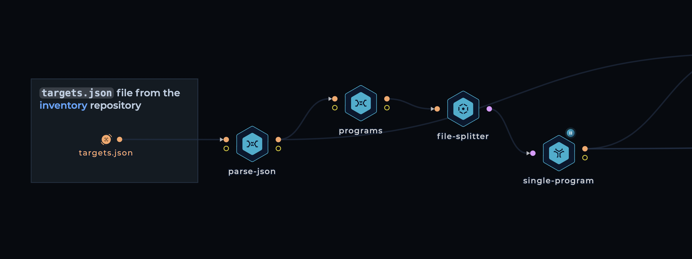
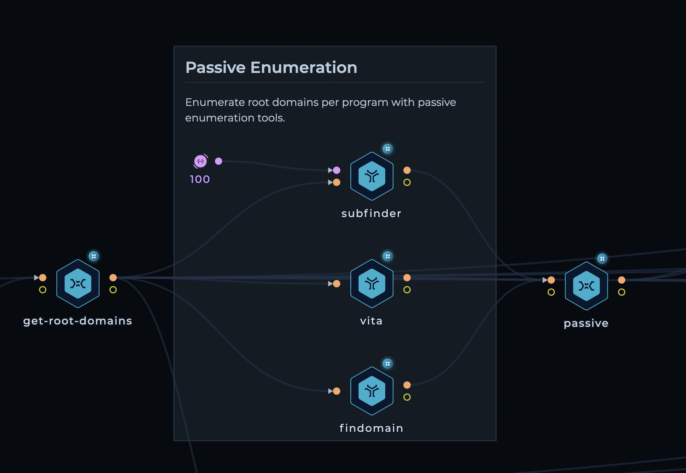
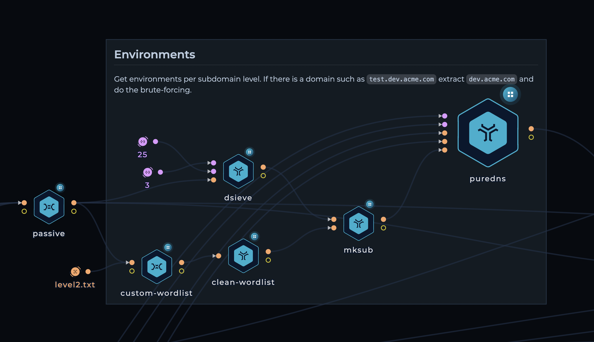
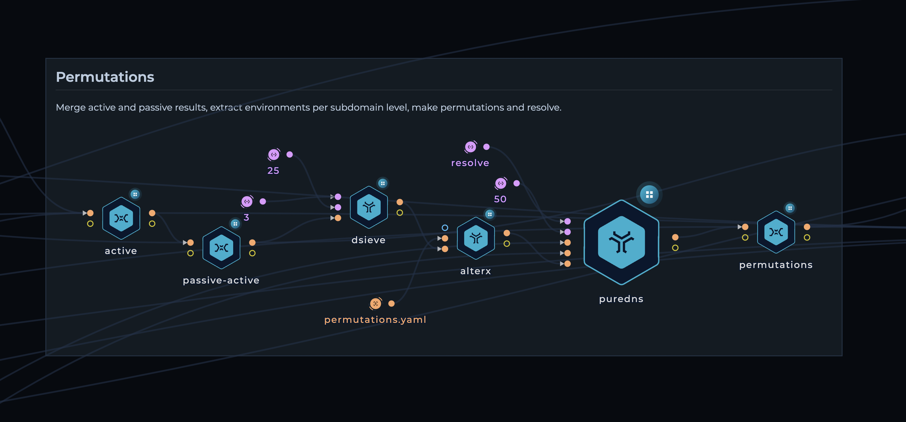
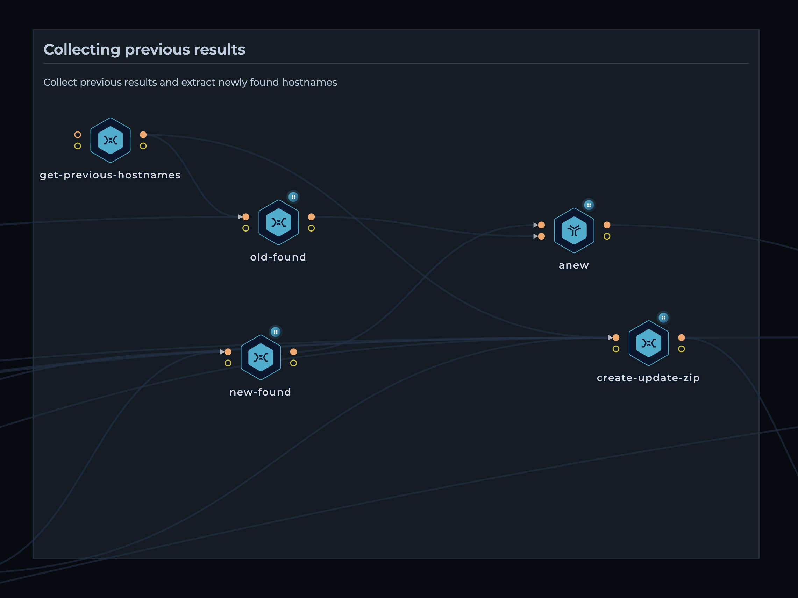
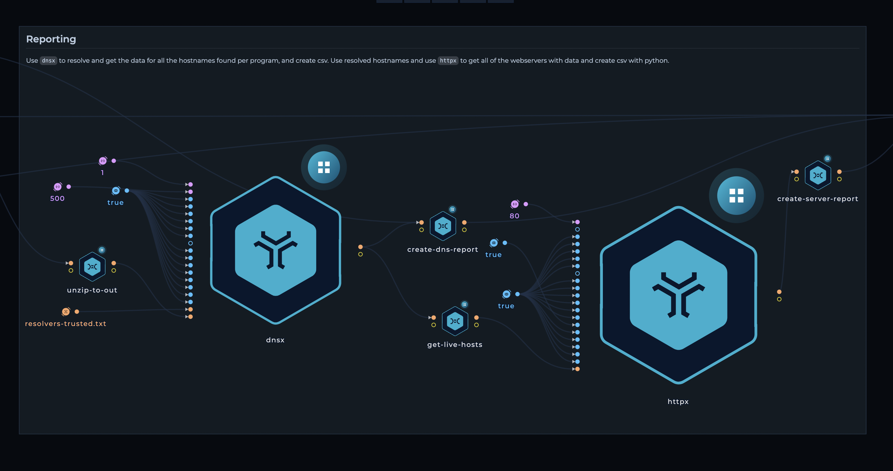
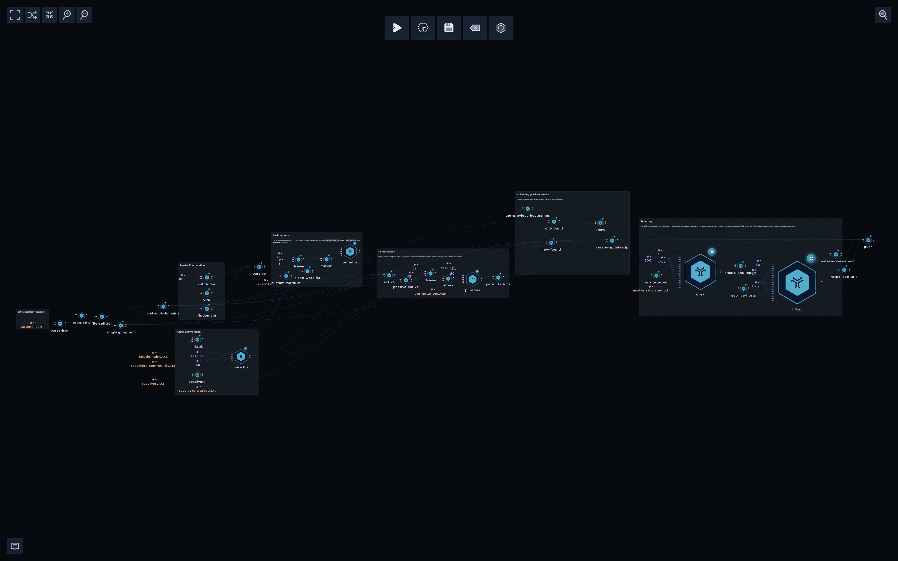

<h1 align="center">Inventory </h1>
<h3 align="center">Attack Surface Management of public bug bounty programs.</h3>

The data we collect here includes DNS and Web Server data of public bug bounty programs.

Our aim with this project is to:

- Monitor [over 800](targets.json) companies for new assets
- help bug bounty hunters get up and running on new programs as quickly as possible.
- give security teams better visibility into their assets.
- reduce the load and noise that some programs face from automated tools (we run them on schedule, and give the results to everyone)

## How it works

The setup consists of two workflows

* Inventory 3.0 - Targets
* Inventory 3.0

### Inventory 3.0 - Targets

This workflow streamlines the consolidation of bug bounty program data from various sources, ensuring a comprehensive and organized view. Let's break it down:

1. **Data collection**: The workflow fetches data from two important sources:
   - [Bounty Targets Data](https://github.com/arkadiyt/bounty-targets-data): This repository contains a wealth of bug bounty program information.
   - [Chaos Public Bug Bounty Programs](https://github.com/projectdiscovery/public-bugbounty-programs): It provides additional valuable bug bounty program data.

2. **Data transformation**: The collected data undergoes transformation using Python scripts. The scripts convert the data into a specific format, ensuring consistency and ease of analysis. You can find the detailed data format in the [targets.json](targets.json) file.

3. **Program merging**: To avoid duplication, the workflow merges programs with the same URL together. This consolidation eliminates redundancies and presents a unified view of bug bounty programs.

4. **Community program inclusion**: The workflow incorporates an additional set of programs from the [community.json](community.json) file. These programs are merged with the existing dataset, enhancing its coverage and diversity.

5. **Final output**: The workflow generates a final consolidated JSON file, [targets.json](targets.json), which encompasses all the merged bug bounty program data. This file serves as a valuable resource for bug bounty researchers, providing a centralized and comprehensive view of programs.

**Note**: The screenshot above provides a visual representation of the workflow.

### Inventory 3.0

1. **Gathering the tagets**: Get the list of domains from [targets.json](targets.json), and extract program names.

2. **Making workflow run in parallel**: Extracted program names are connected `file-splitter` node to make the whole workflow distributed per program

3. **Passive Enumeration**: 
   * Use [subfinder](https://github.com/projectdiscovery/subfinder), [vita](https://github.com/junnlikestea/vita), [findomain](https://github.com/Findomain/Findomain) to get passive enumeration data.
   * Use [mksub](https://github.com/cvedb/mksub) to create a custom list of potential subdomains
   * Resolve with [puredns](https://github.com/d3mondev/puredns) and [cvedb resolvers](https://github.com/cvedb/resolvers)
   * Generate custom-wordlists from passive results with custom bash script

4. **Active Enumeration**
   * Use passive enumeration data and create a new bruteforce wordlist 
   * Use [dsieve](https://github.com/cvedb/dsieve) to get environments per subdomain level
   * Generate new potential subdomains with [mksub](https://github.com/cvedb/mksub) and custom wordlist, with additional [level2.txt wordlist](https://github.com/cvedb/wordlists/blob/main/inventory/levels/level2.txt)
   * Resolve again with [puredns](https://github.com/d3mondev/puredns)
 

5. **Permutations**
   * Merge active and passive results from previous steps
   * Extract environments per subdomain level again
   * Use [alterx](https://github.com/projectdiscovery/alterx) to generate permutations and resolve with [puredns](https://github.com/d3mondev/puredns)

6. **Collecting previous results**
   * Use python script that will get all of the previous `hostnames.txt` per program
   * Use [anew](https://github.com/tomnomnom/anew) to get the new hostnames found 
   * zip active, passive, permutations per program to be pushed to repository

7. **Reporting**
   * Use [dnsx](https://github.com/projectdiscovery/dnsx) to resolve found hostnames and python script for `dns-report.csv`; mark newly found domains coming from [anew](https://github.com/tomnomnom/anew) with `[x]`
   * Use [httpx](https://github.com/projectdiscovery/httpx) to gather web servers and python script for `server-report.csv
   * Push to the repository

### Final workflow

---

> **Note**: As described, almost everything in this repository is generated automatically. We carefully designed the workflows (and continue to develop them) to ensure the results are as accurate as possible.

## Contribution
All contributions/ideas/suggestions are welcome! If you want to add/edit a target/workflow, feel free to send us a PR with new targets through [community.json](community.json), tweet at us [@khulnasoft](https://twitter.com/khulnasoft), or join the conversation on [Discord](https://discord.gg/7HZmFYTGcQ).

## Build your own workflows!
We believe in the value of tinkering. Sign up for a demo on [cvedb.khulnasoft.com](https://cvedb.khulnasoft.com) to customize this workflow to your use case, get access to many more workflows, or build your own from scratch!

